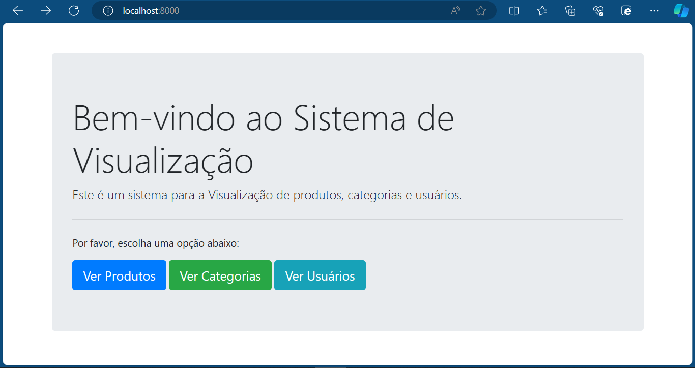
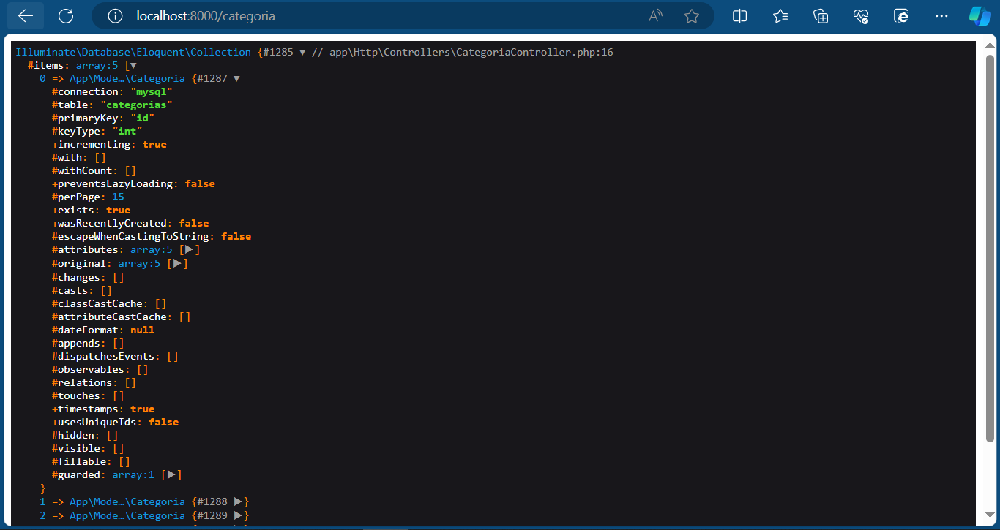
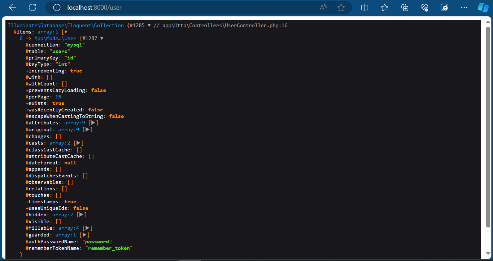
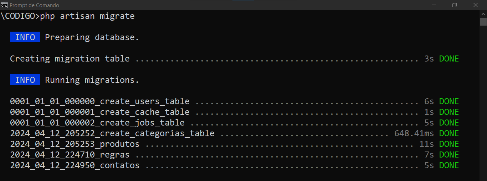
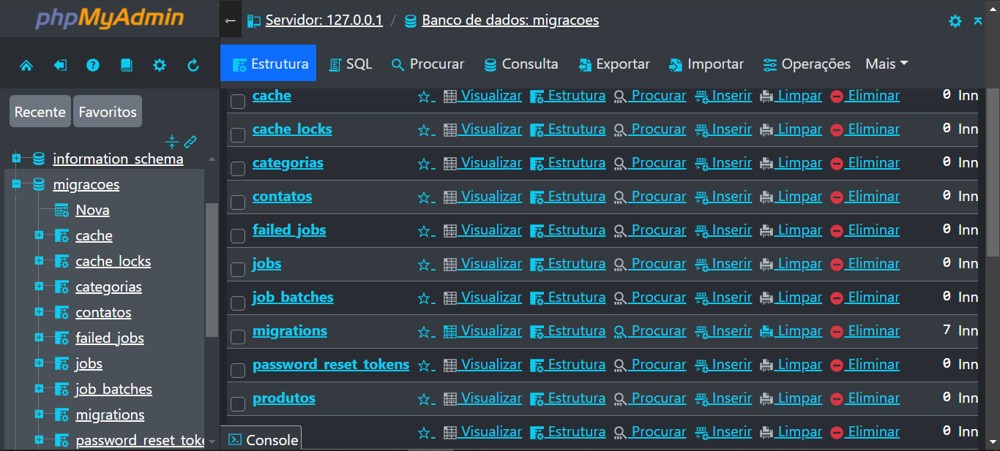
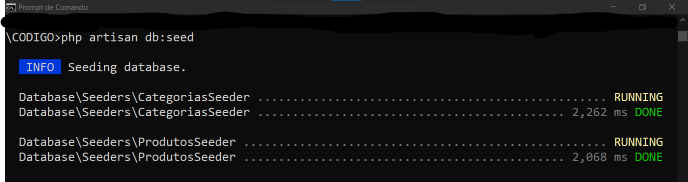
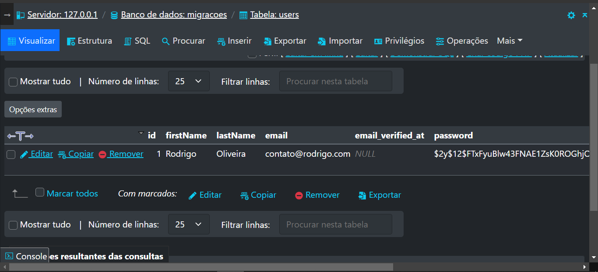
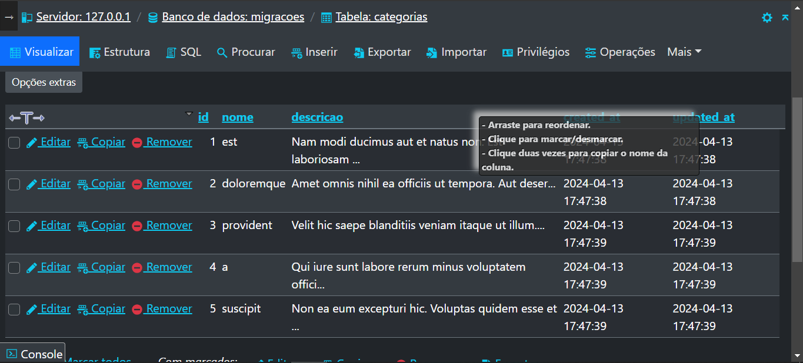
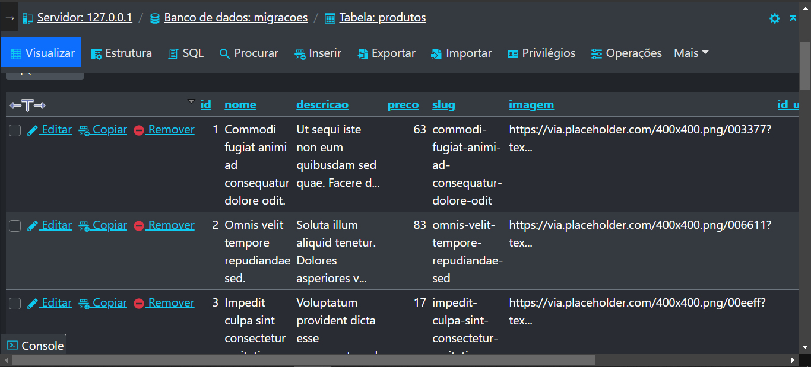
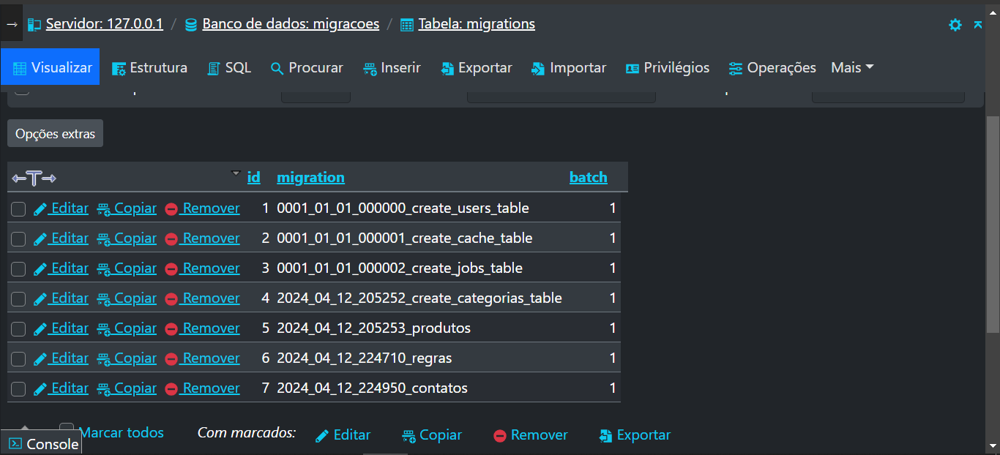

# MIGRACOES COM LARAVEL
👨‍🏫PROJETO CRIADO PARA O CURSO DE LARAVEL.

 <br> 
 <br> 
 <br> 
 <br>

<details>
<summary>CLIQUE AQUI PARA VER MAIS FOTOS!</summary>
    <br>
    <br>
    <br>
    <br>
    <br>
    <br>
    <br>
</details>

## DESCRIÇÃO:
- Este aplicativo é um sistema de exibição de produtos, categorias e usuários construído com o framework Laravel e Bootstrap. Aqui está uma descrição detalhada do que o aplicativo faz: 

1. **Página de Boas-Vindas:**
   - Ao acessar o aplicativo, os usuários são recebidos com uma mensagem de boas-vindas na página inicial.
   - A página inicial inclui uma breve introdução ou descrição do aplicativo e seus recursos principais.
   - Ela inclui botões com links para outras partes importantes do aplicativo, como páginas de produtos, categorias ou perfis de usuário.
   - Isso permite que os usuários naveguem facilmente para outras seções do aplicativo a partir da página inicial.
   - Utiliza Bootstrap para criar um layout moderno e esteticamente agradável.

2. **Visualização de Produtos:**
   - Permite visualizar todos os produtos disponíveis no sistema.
   - Cada produto é exibido com informações como nome, descrição, preço e imagem.

3. **Visualização de Categorias:**
   - Permite visualizar todas as categorias disponíveis no sistema.
   - As categorias são listadas para ajudar na organização dos produtos.

4. **Visualização de Usuários:**
   - Permite visualizar informações básicas sobre os usuários do sistema.
   - Os usuários são listados para fornecer uma visão geral dos perfis registrados.

## PROPOSITO:
O propósito deste aplicativo é criar uma estrutura básica para o desenvolvimento de um aplicativo da web utilizando o framework Laravel. Ele envolve várias etapas importantes no processo de desenvolvimento de software:

1. **Criação de Migrações de Banco de Dados:**
   - O aplicativo utiliza migrações de banco de dados para definir a estrutura do banco de dados de forma programática.
   - As migrações são usadas para criar, modificar ou excluir tabelas e campos no banco de dados de uma maneira controlada e reversível.

2. **Seeders para População do Banco de Dados:**
   - Seeders são usados para preencher o banco de dados com dados de teste ou dados iniciais.
   - Eles permitem criar registros fictícios em massa para simular dados reais e facilitar o desenvolvimento e teste do aplicativo.

3. **Factories para Geração de Dados Fictícios:**
   - As factories são usadas em conjunto com os seeders para gerar dados fictícios de maneira rápida e eficiente.
   - Elas definem modelos para criar instâncias de modelos com dados fictícios aleatórios, facilitando a criação de registros de teste.

4. **Rotas, Controllers e Views:**
   - O aplicativo também utiliza rotas, controllers e views para construir a lógica e a interface do usuário.
   - As rotas definem os pontos de entrada do aplicativo e mapeiam URLs para ações específicas nos controllers.
   - Os controllers contêm a lógica de manipulação das requisições HTTP e interagem com o banco de dados, se necessário.
   - As views são responsáveis por renderizar o conteúdo HTML que será exibido aos usuários, utilizando o Blade, o mecanismo de templates do Laravel.

## EXECUTANDO O PROJETO:
**1. Configuração do arquivo `.env`:**
   - Antes de executar o aplicativo, é necessário configurar o arquivo de ambiente `.env` com as informações do seu banco de dados MySQL.
   - Abra o arquivo `.env` localizado na raiz do diretório do projeto `CODIGO` e insira as informações do seu banco de dados conforme abaixo:
   ```plaintext
   DB_CONNECTION=mysql
   DB_HOST=127.0.0.1
   DB_PORT=3306
   DB_DATABASE=MIGRACOES
   DB_USERNAME=seu_usuario
   DB_PASSWORD=sua_senha
   ```
   Certifique-se de substituir `seu_usuario` e `sua_senha` pelos detalhes de autenticação do seu banco de dados MySQL.

**2. Criação do Banco de Dados MySQL:**
   - Após configurar o arquivo `.env`, é necessário criar o banco de dados MySQL com o nome especificado na configuração.
   - Execute o seguinte comando SQL no seu cliente MySQL ou na linha de comando:
   ```sql
   CREATE DATABASE MIGRACOES CHARACTER SET utf8mb4 COLLATE utf8mb4_unicode_ci;
   ```
   Isso garantirá que o banco de dados seja criado com a codificação `utf8mb4_unicode_ci`, adequada para suportar caracteres multibyte e emojis, se necessário.

**3. Instalando Dependências:**
   - Navegue até o diretório do projeto clonado no seu terminal ou prompt de comando.
   - Execute o seguinte comando para instalar todas as dependências listadas no arquivo `composer.json`:
   ```bash
   composer install
   ```
   Isso instalará todas as dependências necessárias para o funcionamento correto do projeto, garantindo que todas as bibliotecas e pacotes estejam presentes e atualizadas.

**4. Gerenciando as Tabelas:**
   - As migrações já foram criadas utilizando o comando `php artisan make:migration create_table_name --create=table_name...`. Você pode encontrá-las no diretório `./CODIGO/database/migrations`. Lembre-se de que você pode editar esses arquivos antes de executá-los.
   - Para aplicar as migrações ao banco de dados (Apenas para criar as Tabelas), utilize o seguinte comando:
   ```bash
   php artisan migrate
   ``` 
   Este comando executará todas as migrações que ainda não foram aplicadas, garantindo que o esquema do banco de dados esteja atualizado de acordo com suas definições.

   - Para executar vários seeders de uma vez (Inserir os registros nas Tabelas), você pode usar o comando `db:seed` sem argumentos:
   ```bash
   php artisan db:seed
   ```
   Isso executará todos os seeders registrados no método `run()` do arquivo `DatabaseSeeder.php`, localizado no diretório `database/seeders`. Até o momento, foram criados seeders apenas para as tabelas: `Produtos`, `Users` e `Categorias`. Você pode criar outros para `regras`.

   - Caso você enfrente algum problema com este passo, deixei o arquivo `DATABASE/DATABASE.sql` disponível para importação direta. Este arquivo contém apenas as tabelas com seus respectivos conteúdos.

**5. Executando o Servidor Embutido:**
   Agora você pode iniciar o servidor embutido do PHP com o seguinte comando:
   ```bash
   php artisan serve
   ```
   Isso iniciará o servidor local e você poderá acessar o aplicativo por meio do navegador da web.

6. **Acessando o Site:**
   * Abra seu navegador da web favorito e digite o seguinte endereço na barra de endereços:
   ```
   http://localhost:8000
   ```
   * Agora você pode explorar o site e interagir com os diferentes recursos clicando nos botões disponíveis!

## FAZENDO MELHORIAS:
O programador pode fazer o fork deste projeto para aprimorá-lo de várias maneiras:

1. **Adicionando Novas Funcionalidades:**
   - O programador pode estender o aplicativo adicionando novas funcionalidades de acordo com os requisitos do projeto.
   - Isso pode incluir a implementação de novas páginas, recursos de autenticação, formulários de entrada de dados, entre outros.

2. **Melhorando a Interface do Usuário:**
   - A interface do usuário pode ser aprimorada para proporcionar uma melhor experiência ao usuário final.
   - Isso pode envolver a criação de estilos CSS personalizados, a introdução de animações, o uso de componentes de interface de usuário mais avançados, entre outros.

3. **Refatorando o Código:**
   - O código-fonte pode ser refatorado para torná-lo mais legível, modular e eficiente.
   - Isso pode incluir a eliminação de código redundante, a divisão de funcionalidades em componentes reutilizáveis, a melhoria da estrutura do projeto, entre outros.

4. **Adaptando o Aplicativo para Diferentes Contextos:**
   - O aplicativo pode ser adaptado para atender a diferentes contextos ou requisitos específicos do usuário.
   - Isso pode incluir a internacionalização do aplicativo para suportar vários idiomas, a integração com serviços externos, a implementação de recursos específicos do setor, entre outros.

Ao fazer o fork deste projeto, o programador tem a liberdade de personalizá-lo e expandi-lo de acordo com suas próprias necessidades e visão criativa, criando assim uma aplicação web única e sob medida.

## NÃO SABE?
- Entendemos que para manipular arquivos em `HTML`, `CSS` e outras linguagens relacionadas, é necessário possuir conhecimento nessas áreas. Para auxiliar nesse aprendizado, oferecemos cursos gratuitos disponíveis:
* [CURSO DE PHP](https://github.com/VILHALVA/CURSO-DE-PHP)
* [CURSO DE MYSQL](https://github.com/VILHALVA/CURSO-DE-MYSQL)
* [CURSO DE BOOTSTRAP](https://github.com/VILHALVA/CURSO-DE-BOOTSTRAP)
* [CONFIRA MAIS CURSOS](https://github.com/VILHALVA?tab=repositories&q=+topic:CURSO)

## CREDITOS:
- [PROJETO CRIADO PARA O CURSO DE LARAVEL](https://github.com/VILHALVA/CURSO-DE-LARAVEL)
- [PROJETO FEITO PELO VILHALVA](https://github.com/VILHALVA)


